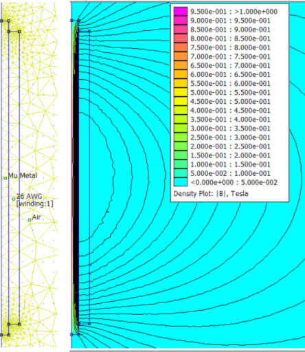
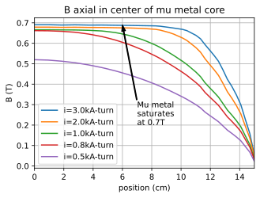
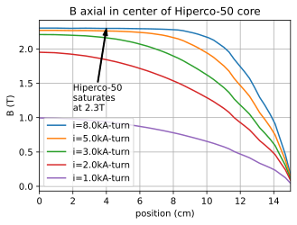
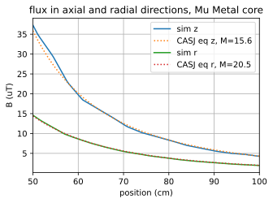

# SolenoidSimulations

## Finite Element analysis of solenoids and magnetorquers using FEMM and Python

This code is useful for analyzing the magnetic fields around solenoids. The simulations are performed using the software package FEMM [https://www.femm.info/wiki/HomePage](). FEMM has a user interface, but I use the simulator entirely through Python code using [https://pypi.org/project/pyfemm/](). After installing FEMM, then run 'pip install pyfemm'. I even create all the mechanical structures using Python.

A typical simulation output of the magnetic flux around a solenoid is shown below.

It is difficult to compare results like the one above for multiple devices and at multiple drive currents, so plotting the magnetic flux at one point is more useful. For instance the images below show the axial flux in the center of two identically sized solenoids made with different materials.

It is also possible to plot the flux in different positions and compare the results to the equations described in [Lee et.al., CASI 2002](https://www.researchgate.net/publication/242270492_On_Determining_Dipole_Moments_of_a_Magnetic_Torquer_Rod_-_Experiments_and_Discussions).

In the center of the solenoid in the radial direction the flux is:
$$B_{radial} = {&mu;_0 \over {4 &pi;}}M{1\over \left( R^2 + {L^2 \over 4} \right)^{3 \over 2}}$$

Along the center axis of the solenoid in the axial direction the flux is:
$$B_{axial} = {&mu;_0 \over {4 &pi;}}M \left[ {{{R \over L} - {1 \over 2}}\over \left( R^2 -RL + {L^2 \over 4} \right)^{3 \over 2}} - 
{{{R \over L} - {1 \over 2}}\over \left( R^2 +RL + {L^2 \over 4} \right)^{3 \over 2}} \right]$$

$&mu;_0$ is the permittivity of space, R is the distance from center of magnetic core, L is the length of the winding, and M is the magnetic moment.

The comparison of the simulated results for these axial and radial fluxes with the equations shown below for two different mesh sizes. Finer meshes are more accurate, but the simulations take longer.

For magnetorquer the magnetic moment 'M' is an important parameter. It can be extracted from the simulation data by fitting the equations to minimize the least square error of the magnetic moment

